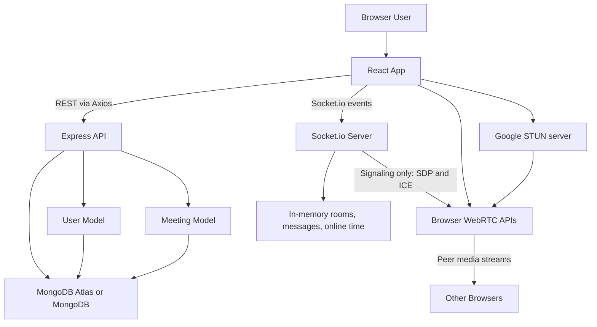

# Video Conference Codebase Interview Guide

This guide explains the forked `Zoom` project as it exists in this repository. The project is a full-stack video meeting application with a React frontend, an Express backend, MongoDB persistence through Mongoose, Socket.io signaling, and browser WebRTC media connections.

Important correction for interviews: this code does not use JWT. It uses random server-generated tokens stored on the user document. If an interviewer asks about JWT, explain how JWT would be an alternative and why the current implementation is simpler but weaker.

## 1. Repository Structure

```text
Video_Conference_call/
  package-lock.json
  TODO.md
  Zoom/
    README.md
    backend/
      package.json
      package-lock.json
      node_modules/
      src/
        app.js
        controllers/
          socketManager.js
          user.controller.js
        models/
          meeting.model.js
          user.model.js
        routes/
          users.routes.js
    frontend/
      README.md
      package.json
      package-lock.json
      public/
        background.png
        favicon.ico
        index.html
        logo192.png
        logo3.png
        logo512.png
        manifest.json
        mobile.png
        robots.txt
      src/
        App.css
        App.js
        App.test.js
        environment.js
        index.css
        index.js
        logo.svg
        reportWebVitals.js
        setupTests.js
        contexts/
          AuthContext.jsx
          backend.code-workspace
        pages/
          VideoMeet.jsx
          authentication.jsx
          history.jsx
          home.jsx
          landing.jsx
        styles/
          videoComponent.module.css
        utils/
          withAuth.jsx
```

## 2. Major Folders And Files

### Root

- `TODO.md`: Local project notes. It says the backend MongoDB connection needed to use `MONGODB_URI`; the current `backend/src/app.js` already reads `process.env.MONGODB_URI`.
- `package-lock.json`: A root lockfile without an obvious root `package.json`. It is probably accidental or left over.
- `Zoom/README.md`: Minimal project description.
- `Zoom/.git/`: The actual Git repository appears to be inside `Zoom`, making the outer folder a wrapper.

### Backend

- `backend/package.json`: Defines the Node backend package, scripts, module type, and dependencies. Scripts: `npm run dev` uses nodemon, `npm start` uses Node, `npm run prod` uses pm2.
- `backend/src/app.js`: Backend entry point. Loads env vars, creates Express app and HTTP server, attaches Socket.io, configures CORS and body parsers, mounts user routes, connects to MongoDB, then starts listening.
- `backend/src/routes/users.routes.js`: Express router for all user-related REST APIs.
- `backend/src/controllers/user.controller.js`: Implements signup, login, meeting history retrieval, and meeting history creation.
- `backend/src/controllers/socketManager.js`: Implements Socket.io real-time meeting rooms, WebRTC signaling relay, chat broadcast, and disconnect handling.
- `backend/src/models/user.model.js`: Mongoose schema/model for users.
- `backend/src/models/meeting.model.js`: Mongoose schema/model for meeting history records.
- `backend/node_modules/`: Installed backend dependencies. This should usually not be committed.

### Frontend

- `frontend/package.json`: Create React App package with React 18, React Router, Axios, MUI, Socket.io client, and test dependencies.
- `frontend/public/index.html`: HTML shell used by Create React App.
- `frontend/public/*.png`, `favicon.ico`, `manifest.json`: Static assets and PWA metadata.
- `frontend/src/index.js`: React entry point. Mounts `<App />` into `#root`.
- `frontend/src/App.js`: Defines the client routes and wraps the app with `AuthProvider`.
- `frontend/src/environment.js`: Chooses backend URL. Currently `IS_PROD = true`, so it always points to `https://apnacollegebackend.onrender.com` unless edited.
- `frontend/src/contexts/AuthContext.jsx`: Central API client and auth helper functions for register, login, fetch history, and save meeting history.
- `frontend/src/utils/withAuth.jsx`: Higher-order component that checks `localStorage.token` and redirects unauthenticated users to `/auth`.
- `frontend/src/pages/landing.jsx`: Public landing page with guest join, register, login, and get-started navigation.
- `frontend/src/pages/authentication.jsx`: Login/register page using Material UI components.
- `frontend/src/pages/home.jsx`: Auth-protected home screen where users enter a meeting code and navigate to the meeting.
- `frontend/src/pages/history.jsx`: Shows saved meeting history for the current token.
- `frontend/src/pages/VideoMeet.jsx`: Core meeting UI. Handles media permissions, WebRTC peers, Socket.io events, chat, mute/video/screen-share controls, and rendering remote streams.
- `frontend/src/App.css`: Global page styling for landing and home.
- `frontend/src/styles/videoComponent.module.css`: CSS module for the meeting page.
- `frontend/src/App.test.js`: Default Create React App test. It is stale and likely fails because the app no longer renders "learn react".

## 3. Overall Architecture



Core idea: REST handles account and history data. Socket.io handles coordination messages. WebRTC carries audio/video peer-to-peer between browsers. MongoDB stores durable user and meeting-history data. Socket room state and chat messages are currently stored only in backend memory.

## 4. Complete Application Flow

1. Backend starts from `backend/src/app.js`.
2. Express app and Node HTTP server are created.
3. Socket.io is attached to the same HTTP server through `connectToSocket(server)`.
4. Middleware is registered: CORS, JSON body parser, URL-encoded parser.
5. User routes are mounted under `/api/v1/users`.
6. Backend reads `MONGODB_URI`; if missing, it exits.
7. Mongoose connects to MongoDB.
8. Server listens on `PORT` or `8000`.
9. Frontend starts from `frontend/src/index.js` and renders `App`.
10. `App.js` sets routes: `/`, `/auth`, `/home`, `/history`, and `/:url`.
11. Public users see landing/auth pages.
12. Authenticated users are recognized only by the presence of `localStorage.token`.
13. Users join meetings by navigating to `/:meetingCode`.
14. `VideoMeet.jsx` asks for camera/microphone permissions in the browser.
15. After the user enters a display name and clicks connect, the browser opens a Socket.io connection.
16. Socket.io joins the user to a room based on `window.location.href`.
17. Existing clients in that room receive `user-joined`.
18. Each client creates WebRTC peer connections, exchanges SDP offers/answers and ICE candidates through Socket.io `signal` events.
19. Once WebRTC negotiation succeeds, media streams flow directly between browsers.
20. Chat messages are sent to the backend via Socket.io and broadcast to all socket IDs in that room.

## 5. Technologies, Choices, Problems Solved, Usage, Alternatives

### React

- Why chosen: Good for dynamic UI with stateful screens like auth, lobby, meeting controls, remote videos, and chat.
- Problem solved: Keeps UI state and DOM rendering manageable.
- Used here: Components, hooks, context, router pages, conditional rendering.
- Alternatives: Vue, Angular, Svelte, Next.js. React is flexible but needs manual architecture choices. Angular is more opinionated. Next.js adds routing/server rendering but is heavier for a simple SPA.

### Create React App

- Why chosen: Fast beginner-friendly React setup.
- Problem solved: Webpack/Babel/dev-server configuration.
- Used here: `react-scripts start/build/test`.
- Alternatives: Vite, Next.js, custom Webpack. Vite is faster and more modern. CRA is now less preferred for new projects.

### React Router

- Why chosen: SPA navigation without full page reloads.
- Problem solved: Maps URL paths to pages.
- Used here: `/`, `/auth`, `/home`, `/history`, `/:url`.
- Alternatives: Next.js file routing, TanStack Router, manual conditional rendering.

### Material UI

- Why chosen: Ready-made form, button, icon, card, badge, and layout components.
- Problem solved: Speeds up UI implementation.
- Used here: Auth form, home controls, history cards, meeting icons.
- Alternatives: Chakra UI, Ant Design, Tailwind CSS, custom CSS. MUI is feature rich but can increase bundle size and visual sameness.

### Axios

- Why chosen: Simple HTTP client with base URL support.
- Problem solved: Sends REST requests to the backend.
- Used here: Register, login, get history, add history.
- Alternatives: `fetch`, React Query, SWR. Axios is convenient; React Query adds caching and loading/error state patterns.

### Node.js

- Why chosen: JavaScript on the server, good event-driven I/O for APIs and sockets.
- Problem solved: Runs backend HTTP and real-time server.
- Used here: Express app, HTTP server, Socket.io, Mongoose.
- Alternatives: Python/FastAPI, Java/Spring, Go, Ruby/Rails. Node is easy for full-stack JS but CPU-heavy workloads need care.

### Express

- Why chosen: Minimal web framework.
- Problem solved: Routing, middleware, request/response handling.
- Used here: `/api/v1/users/*` endpoints, JSON parsing, CORS.
- Alternatives: Fastify, NestJS, Koa. Fastify is faster; NestJS gives structure but more boilerplate.

### MongoDB

- Why chosen: Flexible document database.
- Problem solved: Stores user documents and meeting history without rigid SQL schema.
- Used here: `users` and `meetings` collections through Mongoose.
- Alternatives: PostgreSQL, MySQL, Firebase, DynamoDB. SQL is stronger for relational constraints and joins. MongoDB is easy for document-shaped data.

### Mongoose

- Why chosen: Schema/model layer over MongoDB.
- Problem solved: Defines data shapes, validation, and query helpers.
- Used here: `User.findOne`, `Meeting.find`, `.save()`.
- Alternatives: Native MongoDB driver, Prisma MongoDB, Typegoose. Native driver gives control but less structure.

### Socket.io

- Why chosen: Easier real-time events than raw WebSocket, with reconnection and fallback behavior.
- Problem solved: Meeting presence, chat, and WebRTC signaling.
- Used here: Events: `join-call`, `user-joined`, `signal`, `chat-message`, `user-left`.
- Alternatives: Native WebSocket, WebRTC data channels, Firebase Realtime Database, Pusher. Socket.io is convenient but not the same protocol as raw WebSocket.

### WebRTC

- Why chosen: Browser-native peer-to-peer audio/video.
- Problem solved: Sends media directly between users without routing all video through the backend.
- Used here: `getUserMedia`, `getDisplayMedia`, `RTCPeerConnection`, SDP, ICE candidates.
- Alternatives: Media servers like SFU/MCU using mediasoup, Janus, Jitsi, LiveKit, Twilio Video. Peer-to-peer is simple for small rooms but does not scale well to large meetings.

### STUN

- Why chosen: Helps peers discover public network addresses for NAT traversal.
- Problem solved: WebRTC clients behind routers need ICE candidates.
- Used here: `stun:stun.l.google.com:19302`.
- Alternatives: TURN servers such as coturn. STUN is free/simple but fails on restrictive networks; TURN relays media and is more reliable but costs bandwidth.

### bcrypt

- Why chosen: Password hashing designed to be slow and salted.
- Problem solved: Protects stored passwords if the database leaks.
- Used here: `bcrypt.hash(password, 10)` during register and `bcrypt.compare` during login.
- Alternatives: Argon2, scrypt, PBKDF2. Argon2 is a modern preferred option; bcrypt is still widely accepted.

### crypto tokens

- Why chosen: Built-in Node API for random bytes.
- Problem solved: Creates login tokens.
- Used here: `crypto.randomBytes(20).toString("hex")`, stored in `user.token`.
- Alternatives: JWT, opaque session IDs in Redis, cookie sessions. Current approach is simple but lacks expiry, rotation history, multi-device sessions, and strong middleware enforcement.

### JWT

- Status here: Not used.
- What it would solve: Stateless signed authentication tokens with claims and expiry.
- Trade-offs: JWT reduces database lookups but is harder to revoke immediately. Current DB token is easy to revoke by changing the token but every protected operation needs a lookup.

### CORS

- Why chosen: Allows frontend and backend on different origins.
- Problem solved: Browser same-origin restrictions.
- Used here: Backend REST CORS uses `app.use(cors())`; Socket.io CORS allows all origins.
- Alternatives: Same-origin deployment, reverse proxy, strict allowlist. Production should use a strict origin allowlist.

### dotenv

- Why chosen: Loads secrets/config from `.env`.
- Problem solved: Keeps environment-specific values out of source.
- Used here: `import 'dotenv/config'` and `process.env.MONGODB_URI`.
- Alternatives: Platform environment config, secret managers. `.env` is good locally but should not be committed.

### nodemon and pm2

- Why chosen: Developer reload and production process manager.
- Problem solved: Nodemon restarts on file changes; pm2 manages long-running processes.
- Used here: `npm run dev`, `npm run prod`.
- Alternatives: Node `--watch`, Docker, systemd, cloud runtime managers.

## 6. Database Schemas

### `users` collection

Defined by `backend/src/models/user.model.js`.

Fields:

- `name`: String, required. User's full/display name at registration.
- `username`: String, required, unique. Login identifier. The unique index prevents duplicate usernames.
- `password`: String, required. bcrypt-hashed password, not plaintext.
- `token`: String, optional. Latest login token.

Design decisions:

- Usernames are unique and used as the durable user identifier in meeting history.
- Passwords are hashed, which is good.
- Token is stored directly on the user, meaning one active token per user in practice.
- No timestamps, email verification, roles, refresh tokens, or password reset fields.

### `meetings` collection

Defined by `backend/src/models/meeting.model.js`.

Fields:

- `user_id`: String. Actually stores `user.username`, not Mongo `_id`.
- `meetingCode`: String, required. Code/path the user joined.
- `date`: Date, required, defaults to `Date.now`.

Design decisions:

- Meeting history is denormalized by username string.
- No foreign-key-like ObjectId reference to `User`.
- No index on `user_id`, which can become slow for large history collections.
- No room metadata, duration, participants, title, owner, or permissions.

Relationships:

- Logical one-to-many: one user can have many meeting history records.
- Implemented by matching `Meeting.user_id` to `User.username`, not by Mongoose `ref`.

## 7. Important User Actions

### User signup

1. User goes to `/auth`.
2. `authentication.jsx` switches to Sign Up mode.
3. User enters name, username, password.
4. `handleAuth` calls `handleRegister` from `AuthContext`.
5. Axios POSTs to `/api/v1/users/register`.
6. Express router calls `register`.
7. Backend checks `User.findOne({ username })`.
8. If username exists, returns 302 with "User already exists".
9. If new, backend hashes password with bcrypt.
10. Backend creates and saves `new User`.
11. Frontend shows snackbar and switches back to login mode.

### User login

1. User enters username/password on `/auth`.
2. `handleAuth` calls `handleLogin`.
3. Axios POSTs to `/api/v1/users/login`.
4. Backend validates required fields.
5. Backend finds user by username.
6. Backend compares password with bcrypt.
7. If valid, backend creates a random hex token and saves it on user.
8. Backend returns `{ token }`.
9. Frontend stores token in `localStorage`.
10. Frontend navigates to `/home`.

### Creating or joining a meeting

There is no separate "create meeting" API. A meeting exists when users navigate to the same URL/code.

1. Authenticated user enters a meeting code on `/home`.
2. Frontend calls `addToUserHistory(meetingCode)`.
3. Backend finds the user by token and saves a `Meeting` record.
4. Frontend navigates to `/${meetingCode}`.
5. `VideoMeet.jsx` asks for display name in lobby.
6. User clicks Connect.
7. Client joins Socket.io room identified by `window.location.href`.

Guest flow: landing page "Join as Guest" navigates to hardcoded `/aljk23`; it does not save history or require auth.

### Real-time communication

1. Client connects to Socket.io server.
2. Client emits `join-call` with the full current URL.
3. Server stores the socket ID in `connections[path]`.
4. Server emits `user-joined` to all sockets in that path.
5. Clients create `RTCPeerConnection` objects for socket IDs.
6. Clients exchange WebRTC SDP and ICE through `signal` events.
7. Browser WebRTC establishes direct media streams.
8. Chat uses Socket.io `chat-message` and server broadcast.
9. On disconnect, server emits `user-left` and removes socket ID from the in-memory room.

### Data storage and retrieval

- Users are stored when registering.
- Tokens are stored when logging in.
- Meeting history is stored when the authenticated user clicks Join from `/home`.
- History is retrieved from `/get_all_activity?token=...`.
- Active room membership and chat messages are not stored in MongoDB; they live in backend memory only.

## 8. APIs

Base URL: `${server}/api/v1/users`

### `POST /register`

Request body:

```json
{ "name": "Alice", "username": "alice", "password": "secret" }
```

Flow:

- Express JSON middleware parses body.
- `users.routes.js` maps to `register`.
- Controller checks duplicate username.
- Password is hashed with bcrypt.
- New user document is saved.

Responses:

- `201 Created`: `{ "message": "User Registered" }`
- `302 Found`: `{ "message": "User already exists" }`
- Generic JSON error on exception.

Database operations:

- `User.findOne({ username })`
- `new User(...).save()`

### `POST /login`

Request body:

```json
{ "username": "alice", "password": "secret" }
```

Flow:

- Express JSON middleware parses body.
- Controller validates presence of username/password.
- Finds user.
- Compares bcrypt password.
- Creates random token and saves it.

Responses:

- `200 OK`: `{ "token": "randomhex" }`
- `400 Bad Request`: missing fields
- `404 Not Found`: user missing
- `401 Unauthorized`: password mismatch
- `500`: unexpected error

Database operations:

- `User.findOne({ username })`
- `user.save()` after setting token

### `POST /add_to_activity`

Request body:

```json
{ "token": "randomhex", "meeting_code": "room123" }
```

Flow:

- Controller finds user by token.
- Creates meeting history with `user_id = user.username`.
- Saves meeting.

Responses:

- `201 Created`: `{ "message": "Added code to history" }`
- Generic JSON error on exception.

Database operations:

- `User.findOne({ token })`
- `new Meeting(...).save()`

Middleware/auth concern:

- There is no separate auth middleware. Token validation happens inside controller and does not handle missing user cleanly.

### `GET /get_all_activity`

Query:

```text
?token=randomhex
```

Flow:

- Controller finds user by token.
- Finds all meetings where `user_id` equals `user.username`.
- Returns array.

Response:

- `200 OK` with meeting array, or generic JSON error.

Database operations:

- `User.findOne({ token })`
- `Meeting.find({ user_id: user.username })`

## 9. Authentication And Authorization

Current mechanism:

- Registration hashes passwords with bcrypt.
- Login verifies password and generates random token.
- Frontend stores token in `localStorage`.
- `withAuth` checks if token exists in localStorage.
- Backend history APIs accept token in query/body and lookup user.

What is missing:

- No JWT.
- No HTTP-only cookies.
- No token expiry.
- No centralized auth middleware.
- No authorization checks for meeting rooms.
- No guest/user role distinction inside meetings.
- No logout API to invalidate token server-side.
- No CSRF strategy, though localStorage token avoids automatic cookie sending.
- No rate limiting for login.

How to explain it:

"This project implements simple opaque-token authentication. The token is random and stored server-side on the user document. It is easier to understand than JWT but less complete. A production system should use auth middleware, expiry, refresh strategy or server-side sessions, and should avoid storing tokens in localStorage if XSS is possible."

## 10. Real-Time Communication And Event Flow

### Server state

`socketManager.js` uses three in-memory objects:

- `connections`: maps room path to an array of socket IDs.
- `messages`: maps room path to chat message history for that server process.
- `timeOnline`: maps socket ID to connection time. The calculated duration is currently unused.

### Events

`connection`:

- Fired when browser connects to Socket.io.
- Server sets up per-socket listeners.

`join-call`:

- Client sends the current page URL.
- Server adds socket to `connections[path]`.
- Server broadcasts `user-joined` with joining socket ID and client list.
- Server replays existing in-memory chat messages for that path to the new socket.

`user-joined`:

- Client creates peer connections for each socket ID in the room.
- Client attaches local media stream.
- If the event is for the current user, client creates offers to existing peers.

`signal`:

- Client sends SDP or ICE to a target socket ID.
- Server relays it to that target.
- Server does not inspect the WebRTC payload.

`chat-message`:

- Client sends text and sender name.
- Server finds the room containing the sender socket ID.
- Server stores the message in memory.
- Server broadcasts message to every socket in that room.

`user-left`:

- Server emits this when a socket disconnects.
- Client removes that remote video tile.

`disconnect`:

- Server searches all rooms, removes socket ID, deletes empty room.

### WebRTC negotiation

1. Each pair of clients creates an `RTCPeerConnection`.
2. Local media stream is added with `addStream`.
3. Offerer calls `createOffer`.
4. Offerer sets local description.
5. Offerer sends SDP through Socket.io `signal`.
6. Receiver sets remote description.
7. Receiver creates answer.
8. Receiver sets local description.
9. Receiver sends answer through `signal`.
10. Both sides exchange ICE candidates through `signal`.
11. Once ICE succeeds, media flows peer-to-peer.

## 11. Environment Variables And External Services

### Backend

- `MONGODB_URI`: Required. MongoDB connection string.
- `PORT`: Optional. Defaults to `8000`.

Current Mongo options:

- `tls: true`
- `tlsAllowInvalidCertificates: true`

Security note: `tlsAllowInvalidCertificates: true` weakens TLS verification and should not be used in production unless there is a very specific reason.

### Frontend

No real environment variables are used. `frontend/src/environment.js` hardcodes:

- Production: `https://apnacollegebackend.onrender.com`
- Local: `http://localhost:8000`

Issue: `IS_PROD = true` means local development still calls the Render backend unless you edit the file.

### External services

- MongoDB Atlas or any MongoDB instance via `MONGODB_URI`.
- Render-hosted backend URL in `environment.js`.
- Google public STUN server: `stun:stun.l.google.com:19302`.
- Unsplash random wallpaper URL in auth page background.

## 12. Seven-Day Learning Roadmap

### Day 1: JavaScript and browser basics

- ES modules, async/await, promises.
- DOM, browser permissions, localStorage.
- HTTP request/response basics.

### Day 2: React fundamentals

- Components, props, state, hooks.
- `useEffect`, `useRef`, controlled inputs.
- Conditional rendering and lists.

### Day 3: Frontend app architecture

- React Router.
- Context API.
- Axios.
- Material UI.
- How route state and auth state interact.

### Day 4: Node, Express, and APIs

- Express app lifecycle.
- Middleware.
- REST route design.
- Status codes and error handling.

### Day 5: MongoDB and Mongoose

- Documents and collections.
- Schemas, models, validation, unique indexes.
- Query patterns and indexing.
- Modeling one-to-many relationships.

### Day 6: Authentication and security

- bcrypt.
- Opaque tokens versus JWT.
- localStorage risks.
- Auth middleware.
- Rate limiting, validation, CORS, secrets.

### Day 7: Real-time systems and WebRTC

- Socket.io events and rooms.
- WebRTC offer/answer model.
- ICE, STUN, TURN.
- Peer-to-peer scaling limits.
- How to explain signaling versus media transport.

## 13. 50 Project-Based Interview Questions With Answers

1. What type of project is this?
   Answer: It is a full-stack video conferencing app. React handles the UI, Express handles REST APIs, MongoDB stores users and meeting history, Socket.io handles real-time signaling/chat, and WebRTC handles peer-to-peer audio/video.

2. What starts the backend?
   Answer: `backend/src/app.js` creates Express, wraps it in a Node HTTP server, attaches Socket.io, connects to MongoDB, then calls `server.listen`.

3. Why does Socket.io need the HTTP server?
   Answer: Socket.io upgrades or manages real-time connections on top of the same HTTP server, so REST and real-time traffic can share one port.

4. What is the frontend entry point?
   Answer: `frontend/src/index.js` creates a React root and renders `<App />`.

5. What does `App.js` do?
   Answer: It defines React Router routes and wraps the app in `AuthProvider` so pages can access authentication functions.

6. How is signup implemented?
   Answer: The frontend posts name, username, and password to `/register`. The backend checks for duplicate username, hashes the password with bcrypt, saves a new user, and returns a success message.

7. How is login implemented?
   Answer: The frontend posts username/password to `/login`. The backend finds the user, compares the password hash, generates a random token, stores it on the user, and returns it.

8. Does this project use JWT?
   Answer: No. It uses opaque random tokens from Node `crypto`. JWT would be signed and self-contained; this token requires a DB lookup.

9. Where is the token stored on the client?
   Answer: In `localStorage` under `token`.

10. Why is localStorage risky?
    Answer: If an XSS bug exists, attacker JavaScript can read the token. HTTP-only secure cookies are often safer for session tokens.

11. How does route protection work?
    Answer: `withAuth.jsx` checks whether `localStorage.getItem("token")` exists. If missing, it redirects to `/auth`.

12. Is backend authorization strong?
    Answer: No. History endpoints manually look up token, but there is no centralized middleware, expiry, or robust missing-user handling.

13. What data is stored in MongoDB?
    Answer: User documents and meeting history documents. Active room state and chat messages are not stored persistently.

14. Why use bcrypt?
    Answer: bcrypt hashes passwords slowly with salt, reducing damage if the database leaks.

15. What is the user schema?
    Answer: `name`, `username`, `password`, and optional `token`.

16. What is the meeting schema?
    Answer: `user_id`, `meetingCode`, and `date`.

17. What is odd about `user_id` in `Meeting`?
    Answer: It stores username as a string rather than a MongoDB ObjectId reference.

18. How is meeting history saved?
    Answer: When a logged-in user clicks Join on home, the frontend posts token and meeting code to `/add_to_activity`; backend saves a `Meeting`.

19. Is there a real create-meeting endpoint?
    Answer: No. A room is created implicitly when someone navigates to a meeting URL and joins through Socket.io.

20. How is a room identified?
    Answer: By `window.location.href`, the full URL, sent in the `join-call` event.

21. Why can using full URL as room key be problematic?
    Answer: Different origins, protocols, or query strings can split what humans think is the same room into different rooms.

22. What does Socket.io do in this app?
    Answer: It tracks who is in a room, broadcasts joins/leaves, relays WebRTC signaling messages, and broadcasts chat messages.

23. Does Socket.io carry video?
    Answer: No. It carries signaling and chat. Video/audio streams are carried by WebRTC peer connections.

24. What is WebRTC signaling?
    Answer: The exchange of SDP offers/answers and ICE candidates needed before browsers can connect media streams.

25. What is SDP?
    Answer: Session Description Protocol. It describes media capabilities and connection parameters for a WebRTC peer.

26. What are ICE candidates?
    Answer: Network address candidates that WebRTC tries in order to connect peers across NATs and firewalls.

27. Why is STUN used?
    Answer: It helps clients discover public-facing network addresses for NAT traversal.

28. Why might STUN not be enough?
    Answer: Some restrictive networks require TURN, which relays media when direct peer-to-peer paths fail.

29. What happens when a new user joins a call?
    Answer: Server stores the socket ID, broadcasts `user-joined`, clients create peer connections, attach streams, and exchange offers/answers/candidates.

30. What happens when a user leaves?
    Answer: Socket.io `disconnect` removes them from the room and emits `user-left`; clients remove their video tile.

31. How does chat work?
    Answer: Client emits `chat-message`. Server finds the sender's room, stores message in memory, and emits it to every socket in that room.

32. Is chat persistent?
    Answer: Only while the backend process is alive. It is stored in an in-memory object, not MongoDB.

33. What role does `useRef` play in `VideoMeet.jsx`?
    Answer: It holds mutable objects like socket instance, socket ID, local video element, and video refs without triggering re-renders.

34. What role does `useState` play in `VideoMeet.jsx`?
    Answer: It tracks media toggles, available permissions, chat UI, messages, username, and remote videos for rendering.

35. Why is `window.localStream` used?
    Answer: It provides a globally accessible current media stream used when creating or updating peer connections. It works but is less clean than a React ref.

36. What does `getUserMedia` do?
    Answer: It asks the browser for camera/microphone streams based on current video/audio state.

37. What does `getDisplayMedia` do?
    Answer: It asks the browser for a screen-sharing stream.

38. Why does the code create black/silent streams?
    Answer: To keep a media stream attached when camera/mic is disabled, avoiding broken peer connections.

39. What is `addStream`?
    Answer: An older WebRTC API for attaching a stream to a peer connection. Modern code usually uses `addTrack`.

40. Why is peer-to-peer WebRTC not ideal for large meetings?
    Answer: Each user must upload media to every other user. Bandwidth and CPU grow quickly as participant count increases.

41. What is an SFU?
    Answer: A Selective Forwarding Unit receives streams from participants and forwards selected streams to others, improving scalability.

42. What is CORS doing here?
    Answer: It lets the frontend call the backend from a different origin and lets Socket.io accept cross-origin connections.

43. What is the risk of `origin: "*"`?
    Answer: Any website can attempt to use the backend/socket server. Production should restrict allowed origins.

44. Why is `tlsAllowInvalidCertificates: true` risky?
    Answer: It disables proper certificate validation, opening the door to man-in-the-middle attacks.

45. What is missing from request validation?
    Answer: Strong validation for username/password length, meeting code format, empty strings, and malformed tokens.

46. What test coverage exists?
    Answer: Only a stale default CRA test. There are no meaningful backend, frontend, auth, or socket tests.

47. How would you improve auth?
    Answer: Add auth middleware, token expiry, logout invalidation, secure cookies or well-designed JWT/session flow, rate limiting, and input validation.

48. How would you improve meeting rooms?
    Answer: Use normalized room IDs, validate meeting codes, add room ownership/permissions, and store room metadata.

49. How would you scale Socket.io?
    Answer: Use Redis adapter for shared room state across server instances and move chat persistence to a database.

50. How would you scale video?
    Answer: Use an SFU such as LiveKit, mediasoup, Janus, or Jitsi instead of full mesh peer-to-peer WebRTC.

## 14. 20 Deep-Dive Follow-Up Questions

1. Why is a random opaque token different from JWT in revocation, expiry, and database lookup behavior?
2. What exact WebRTC messages are sent through Socket.io, and which data flows peer-to-peer?
3. How would the app behave if two backend instances run behind a load balancer?
4. Why does storing `connections` in memory break horizontal scaling?
5. What happens if a user opens the same account on two devices and logs in twice?
6. How would you add token expiry without breaking the existing frontend?
7. How would you convert `Meeting.user_id` to a real ObjectId reference?
8. What indexes would you add for performance?
9. How would you redesign room identity so production and localhost URLs do not create different rooms?
10. What is the difference between STUN and TURN?
11. What is the difference between mesh WebRTC and SFU architecture?
12. Why is `addStream` considered legacy, and how would `addTrack` change the code?
13. How would you persist chat history per meeting?
14. How would you prevent unauthorized users from joining private meetings?
15. How would you rate-limit login and registration?
16. How would you protect against XSS token theft?
17. How would you write integration tests for the REST APIs?
18. How would you test Socket.io events?
19. What failure modes exist if permissions for camera/mic are denied?
20. How would you deploy frontend and backend so CORS can be stricter?

## 15. Weaknesses, Scalability Issues, Security Concerns, Improvements

### Security concerns

- No JWT despite common expectation; current token has no expiry.
- Token stored in localStorage is vulnerable to XSS theft.
- No centralized auth middleware.
- History endpoints do not handle invalid token robustly.
- CORS allows broad access.
- Socket.io accepts any origin.
- `tlsAllowInvalidCertificates: true` weakens MongoDB TLS security.
- No input validation or sanitization layer.
- No rate limiting for login/register.
- No password policy.
- No secure logout on backend.
- Meeting rooms have no access control.
- Meeting code can be guessed.
- Chat messages are not validated.

### Scalability concerns

- Socket room state is in memory, so multiple backend instances will not share rooms.
- Chat state is in memory and lost on restart.
- Peer-to-peer full mesh video does not scale beyond small groups.
- No TURN server means some users may fail to connect.
- No Mongo indexes for meeting history lookup.
- No pagination for history.
- No caching or query optimization.

### Code quality concerns

- `environment.js` hardcodes production mode.
- `VideoMeet.jsx` is very large and mixes media, socket, chat, and UI logic.
- Uses legacy WebRTC `addStream`/`onaddstream`.
- Some state names are unclear.
- There is a typo-like extra prop in `<Route path='/home's ... />`.
- Default CRA test is stale.
- Many errors are returned as generic `res.json` without useful status codes.
- `diffTime` is calculated but unused.
- Meeting history stores username string instead of user ObjectId.
- `node_modules` appears in the repository, which is normally avoided.

### Improvements

- Add `.env.example` and use environment variables in frontend through CRA `REACT_APP_*` or migrate to Vite.
- Add auth middleware that resolves `req.user` from token.
- Add token expiry and backend logout.
- Use HTTP-only secure cookies or a carefully designed JWT/session strategy.
- Add schema validation with Zod/Joi/express-validator.
- Add rate limiting and helmet.
- Restrict CORS origins.
- Remove `tlsAllowInvalidCertificates`.
- Use Mongo ObjectId references or stable user IDs for meetings.
- Add indexes: `User.username`, `User.token`, `Meeting.user_id`, maybe compound `{ user_id, date }`.
- Add pagination and sorting for history.
- Use Socket.io rooms instead of manually managing arrays.
- Use Redis adapter for Socket.io scaling.
- Persist chat if product requires it.
- Replace WebRTC `addStream` with `addTrack`.
- Add TURN server support.
- Split `VideoMeet.jsx` into hooks/components: media hook, socket hook, peer hook, chat panel, controls, video grid.
- Add backend tests for auth/history and frontend tests for auth flow.

## Interview Defense Summary

The project is a small but complete prototype. Its strongest learning value is that it combines multiple real-world concepts: REST APIs, database persistence, password hashing, client-side routing, real-time events, and WebRTC. Its biggest production gaps are authentication maturity, room authorization, in-memory Socket.io state, and peer-to-peer scaling. In an interview, defend it as a learning-focused MVP, then immediately show that you understand what must change for production.
